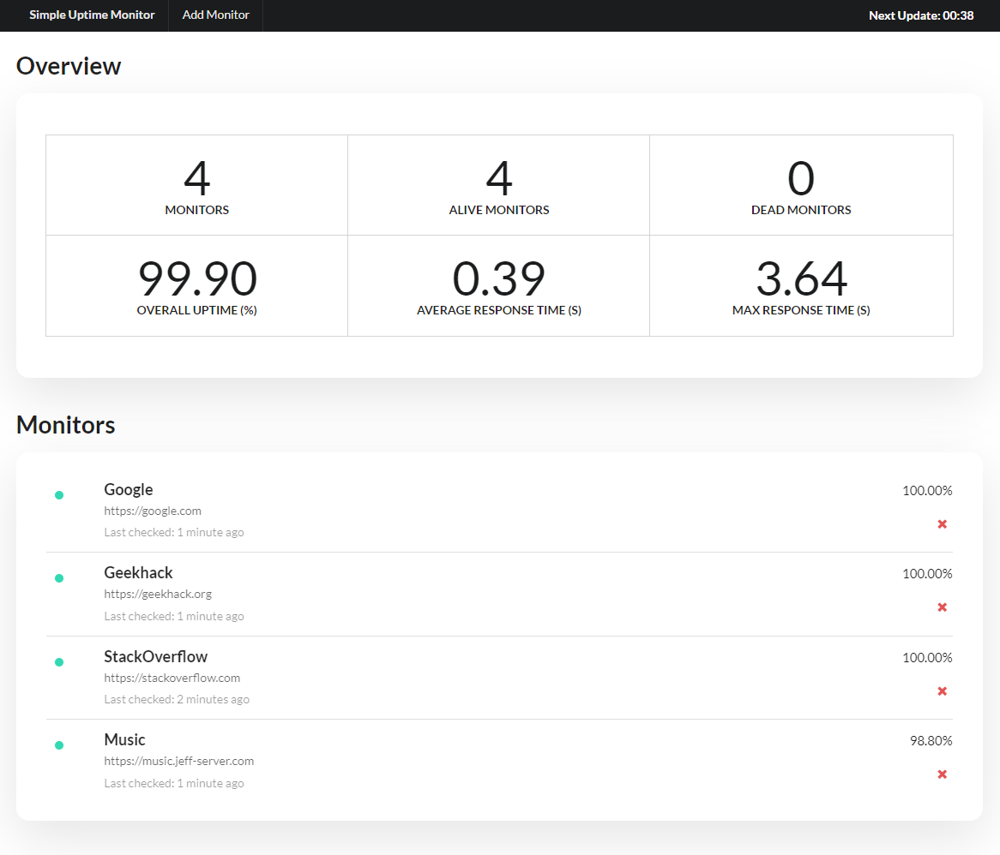
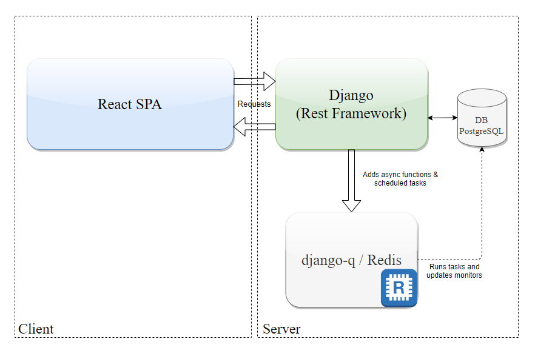

# Simple Uptime Monitor

This project is geared towards being a simple dashboard for sites you want to track the uptime of. Built with React and Django, the webapp provides a single page with monitor details and stats for the user to view.

## Demo

## Architecture

